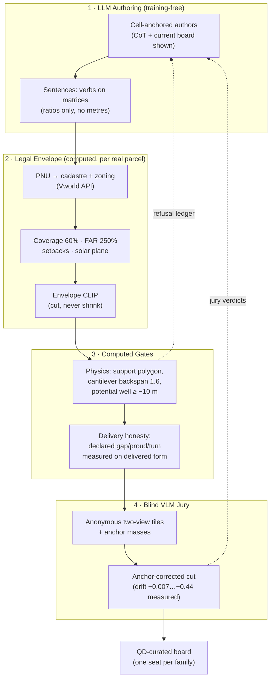

# 그림·표 명세 (4쪽 기준 — F1·F3·F4 + T1·T2가 본문, 나머지는 지면 남으면)

## F1. 파이프라인 플로우 (본문 핵심 도식, 1단 폭)
법규 층을 명시적으로 그린다 — 이 논문의 정체성.

- LaTeX 전환: TikZ로 재작성 (mermaid는 검토용). 점선 = 되먹임 루프 2개 강조.
- 캡션 요지: "Generation proposes; the law and physics dispose; juries select;
  every stage feeds the authors back."

## F2. Base Volume IR (지면 남으면 · 아니면 수식 인라인)
단위입체 [0,1]³ → M∈R⁴ˣ⁴ 포즈 + plan 가족 + 한 축 top_profile 꺾은선(셰드~볼트가
전부 이 항의 경우). `BASEVOLUME-SPEC.md`에서 조판.

## F3. 선택 보드 (실물 증거, 2단 폭 하나)
- `ARR/backend/tmp_mass_check/_massv2/runs/board/sheet_O.png` (해외 16안, 가족당 1석)
- 지면 부족 시 O시트만. 캡션에 "auto-curated, one seat per composition family".

## F4. 렌더-정직성 통제 실험 (주장 1의 그림)
- 좌: 수정 전 winding stack (해골 프레임) `runs/judge-void-ovs/t18.png`의 좌측 뷰
- 우: 수정 후 동일 기하 `runs/judge-refix/t07.png`
- 캡션: geometry unchanged; wall paint order fixed; blind score 2.92 → 4.12 (corrected).

## T1. 깔때기 표 (두 열: 저작 1라운드 / 전 코퍼스)
| stage | one round (ovs2) | full corpus (ovs3-full) |
|---|---|---|
| authored sentences / families | 24 | ~200 (194 survive) |
| legal+growth variants (forms) | 484 | 4,469 |
| physics-plausible | 355 | 3,482 |
| unlawful (clipped out) | 0 | 6 |
| refused sentences | 2 | 26 |
| leximin pool → jury | 10 families | 32 picks / 16 cells |
| jury pass (corrected cut) | 9/10 | — (pre-jury run) |

## T2. 두 심사 상대성 표 (주장 2)
| sentence | Intl. (Concept .35) | Korean (Feasibility .35) |
|---|---|---|
| canyon_to_the_open | 4.25 | 2.83 |
| locked_arms_gate | 4.05 | 3.35 |
| tabletop_porch | 3.10 | 2.40 |
| (역방향) kr_deulmun | — | 4.00 |

## T3. 정직성 게이트 절제 (주장 3)
probe off (void round): 심판행 18, 통과 8 (44%) → probe on (ovs2): 심판행 10, 통과 9 (90%).

## 상태
- [x] F3·F4 원본 파일 존재 확인
- [ ] F1 TikZ 전환 (LaTeX 템플릿 수신 후)
- [x] T1 ovs3-full 수치로 갱신 (형태 4,469 · 물리 3,482 · 16/16 칸)
