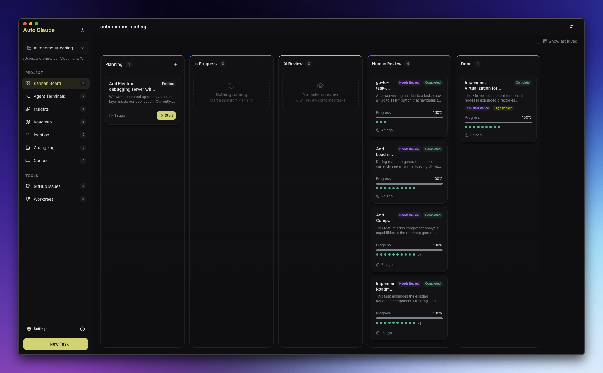

# Auto-Claude

**Unified autonomous coding platform: CLI orchestrator + Electron UI + 20 AI agents**



[](./agpl-3.0.txt)
[](https://discord.gg/KCXaPBr4Dj)
[](https://www.youtube.com/@AndreMikalsen)
[](https://github.com/AndyMik90/Auto-Claude/actions)

---

## Download

### Stable Release

<!-- STABLE_VERSION_BADGE -->
[](https://github.com/AndyMik90/Auto-Claude/releases/tag/v2.7.4)
<!-- STABLE_VERSION_BADGE_END -->

<!-- STABLE_DOWNLOADS -->
| Platform | Download |
|----------|----------|
| **Windows** | [Auto-Claude-2.7.4-win32-x64.exe](https://github.com/AndyMik90/Auto-Claude/releases/download/v2.7.4/Auto-Claude-2.7.4-win32-x64.exe) |
| **macOS (Apple Silicon)** | [Auto-Claude-2.7.4-darwin-arm64.dmg](https://github.com/AndyMik90/Auto-Claude/releases/download/v2.7.4/Auto-Claude-2.7.4-darwin-arm64.dmg) |
| **macOS (Intel)** | [Auto-Claude-2.7.4-darwin-x64.dmg](https://github.com/AndyMik90/Auto-Claude/releases/download/v2.7.4/Auto-Claude-2.7.4-darwin-x64.dmg) |
| **Linux** | [Auto-Claude-2.7.4-linux-x86_64.AppImage](https://github.com/AndyMik90/Auto-Claude/releases/download/v2.7.4/Auto-Claude-2.7.4-linux-x86_64.AppImage) |
| **Linux (Debian)** | [Auto-Claude-2.7.4-linux-amd64.deb](https://github.com/AndyMik90/Auto-Claude/releases/download/v2.7.4/Auto-Claude-2.7.4-linux-amd64.deb) |
| **Linux (Flatpak)** | [Auto-Claude-2.7.4-linux-x86_64.flatpak](https://github.com/AndyMik90/Auto-Claude/releases/download/v2.7.4/Auto-Claude-2.7.4-linux-x86_64.flatpak) |
<!-- STABLE_DOWNLOADS_END -->

### Beta Release

> Beta releases may contain bugs and breaking changes. [View all releases](https://github.com/AndyMik90/Auto-Claude/releases)

<!-- BETA_VERSION_BADGE -->
[](https://github.com/AndyMik90/Auto-Claude/releases/tag/v2.7.2-beta.10)
<!-- BETA_VERSION_BADGE_END -->

<!-- BETA_DOWNLOADS -->
| Platform | Download |
|----------|----------|
| **Windows** | [Auto-Claude-2.7.2-beta.10-win32-x64.exe](https://github.com/AndyMik90/Auto-Claude/releases/download/v2.7.2-beta.10/Auto-Claude-2.7.2-beta.10-win32-x64.exe) |
| **macOS (Apple Silicon)** | [Auto-Claude-2.7.2-beta.10-darwin-arm64.dmg](https://github.com/AndyMik90/Auto-Claude/releases/download/v2.7.2-beta.10/Auto-Claude-2.7.2-beta.10-darwin-arm64.dmg) |
| **macOS (Intel)** | [Auto-Claude-2.7.2-beta.10-darwin-x64.dmg](https://github.com/AndyMik90/Auto-Claude/releases/download/v2.7.2-beta.10/Auto-Claude-2.7.2-beta.10-darwin-x64.dmg) |
| **Linux** | [Auto-Claude-2.7.2-beta.10-linux-x86_64.AppImage](https://github.com/AndyMik90/Auto-Claude/releases/download/v2.7.2-beta.10/Auto-Claude-2.7.2-beta.10-linux-x86_64.AppImage) |
| **Linux (Debian)** | [Auto-Claude-2.7.2-beta.10-linux-amd64.deb](https://github.com/AndyMik90/Auto-Claude/releases/download/v2.7.2-beta.10/Auto-Claude-2.7.2-beta.10-linux-amd64.deb) |
| **Linux (Flatpak)** | [Auto-Claude-2.7.2-beta.10-linux-x86_64.flatpak](https://github.com/AndyMik90/Auto-Claude/releases/download/v2.7.2-beta.10/Auto-Claude-2.7.2-beta.10-linux-x86_64.flatpak) |
<!-- BETA_DOWNLOADS_END -->

> All releases include SHA256 checksums and VirusTotal scan results for security verification.

---

## Requirements

- **Claude Pro/Max subscription** - [Get one here](https://claude.ai/upgrade)
- **Claude Code CLI** - `npm install -g @anthropic-ai/claude-code`
- **Python 3.12+** (for backend agents and CLI)
- **Node.js** (for Electron frontend)
- **Git repository** - Your project must be initialized as a git repo

---

## Quick Start

### Desktop App (Electron UI)

1. **Download and install** the app for your platform
2. **Open your project** - Select a git repository folder
3. **Connect Claude** - The app will guide you through OAuth setup
4. **Create a task** - Describe what you want to build
5. **Watch it work** - Agents plan, code, and validate autonomously

### CLI Mode (24/7 Factory)

```bash
cd AG/Auto-Claude
pip install -r requirements.txt
cp .env.example .env

# Start the 24/7 factory (watches projects/queue/ forever)
python cli.py

# Run a single task through the full pipeline
python cli.py run --task "Build a calculator app"

# See all available commands
python cli.py --help
```

---

## Architecture

Auto-Claude operates as a **3-tier multi-agent orchestration system**:

```
+-------------------------------------------------------------+
|              AutoGen Studio (Port 8081)                       |
|         Strategic Planning & Multi-Team Decision              |
|   6 Agent Teams: Research, Architecture, Implementation,     |
|   QA, DevOps, Documentation                                  |
|                 "Decides WHAT to build"                       |
+-------------------------------------------------------------+
|                         |                                    |
|                         v                                    |
|          Auto-Claude (CLI + Electron Desktop)                |
|      Workflow Orchestration & Quality Management              |
|                                                              |
|   CLI: 20 agents, 3 pipeline patterns, SQLite queue          |
|   UI:  Kanban Board, Agent Terminals, PR Automation          |
|               "Manages HOW to build it"                      |
+-------------------------------------------------------------+
|                         |                                    |
|              +----------+----------+                         |
|              v                     v                         |
|      Claude Agent SDK       Claude Code CLI                  |
|      (Simple Tasks)        (Complex Tasks)                   |
|       Direct sessions       Auto sub-agent                   |
|                             parallelization                  |
|               "Actually WRITES the code"                     |
+-------------------------------------------------------------+
```

### Engine Selection by Complexity

| Task Complexity | Engine | Why |
|----------------|--------|-----|
| **Simple** (bug fix, small feature) | Claude Agent SDK | Fast, lightweight single session |
| **Standard** (multi-file feature) | Claude Code CLI | Sub-agents auto-parallelize |
| **Complex** (full-stack system) | AutoGen Studio + Claude Code | Team discussion for design, then parallel implementation |

### Claude Agent SDK Integration (2026-02-06)

Replaced `subprocess.run("claude -p")` with `claude-agent-sdk` package. **59s -> 15s per call.**

```
AG_Cohub/sdk/           <- Modular SDK package (7 modules)
  auth.py               OAuth token management
  config.py             ToolProfile (TEXT_ONLY/READER/CODER/FULL_AGENT)
  client.py             ClaudeSDK.query() + [TOOL EXECUTED] markers
  context.py            ProjectContext + ContextManager
  hooks.py              quality/logging/budget/security hooks
  tools.py              MCP tool schemas
```

### Tool Execution & Plan Mode

- **agent_config**: JSON team configs pass role profiles to SDK
- **Plan Mode**: `permission_mode: "plan"` for read-only analysis (planner agents)
- **[TOOL EXECUTED] markers**: Differentiates actual tool execution from text output
- **Code output**: All generated files go to `D:\AC247\`

### 20 Agent Pipeline

| # | Family | Agent | Type | Role |
|---|--------|-------|------|------|
| 1-4 | Auto-Claude | Planner, Coder, QA Reviewer, QA Fixer | Claude SDK (OAuth) | Core build pipeline |
| 5-9 | AG Autogen | Research, Analyst, Writer, Reviewer, Coordinator | HTTP/A2A | Research and coordination |
| 10-14 | AG Law | Case Analyzer, Legal Researcher, Risk Assessor, Compliance, Drafter | HTTP/FastAPI | Legal domain |
| 15-19 | AG A2A | Poetry, Philosophy, History, Calculator, GUI Test | Google ADK | Specialized tasks |
| 20 | Claude CLI | Plan Agent | Claude CLI | Headless planning |

---

## Features

| Feature | Description |
|---------|-------------|
| **3-Tier Agent Orchestration** | AutoGen (strategy) -> Auto-Claude (pipeline) -> Claude SDK/Code (execution) |
| **20 AI Agents** | 5 agent families across CLI orchestrator |
| **3 Pipeline Patterns** | Sequential, Parallel Fan-Out/Gather, Generator-Critic Loop |
| **24/7 Factory Mode** | Drop YAML specs into `projects/queue/` for autonomous processing |
| **Autonomous Tasks** | Describe your goal; agents handle planning, implementation, and validation |
| **Parallel Execution** | Run multiple builds simultaneously with up to 12 agent terminals |
| **Isolated Workspaces** | All changes happen in git worktrees - main branch stays safe |
| **Self-Validating QA** | Built-in quality assurance loop catches issues before review |
| **Memory Layer** | Agents retain insights across sessions via Graphiti knowledge graph |
| **AutoGen Integration** | Real-time collaboration with multi-agent teams on port 8081 |
| **GitHub/GitLab** | Import issues, investigate with AI, create merge requests |
| **Cross-Platform** | Native desktop apps for Windows, macOS, and Linux |
| **Auto-Updates** | App updates automatically when new versions are released |

---

## CLI Command Reference

| Command | Description |
|---------|-------------|
| `python cli.py` | Start the 24/7 Factory |
| `python cli.py run --task "..." --complexity standard` | Single task execution |
| `python cli.py run --task "..." --auto-merge` | Execute and auto-merge |
| `python cli.py submit --spec project.yaml` | Submit a project spec |
| `python cli.py list` | List all projects |
| `python cli.py status <ID>` | Show project status |
| `python cli.py services` | Start SharedMemory + MessageBus |
| `python cli.py example` | Create example spec |

Global flags: `--projects-dir`, `--db-path`, `--debug`

---

## Project Structure

```
AG/Auto-Claude/
|-- cli.py                 # CLI entry point (24/7 factory)
|-- requirements.txt       # Python dependencies
|-- package.json           # Monorepo root (npm scripts)
|
|-- apps/
|   |-- backend/           # Python backend - ALL agent logic
|   +-- frontend/          # Electron desktop application
|
|-- src/                   # CLI orchestrator modules
|   |-- coordinator/       # 24/7 orchestration
|   |-- pipeline/          # Execution patterns
|   |-- adapters/          # Agent connections
|   |-- bridge/            # WorkflowExecutor
|   |-- registry/          # Agent capabilities
|   +-- utils/             # Config, models, logger
|
|-- ag_cli/                # Collaborative agents (MessageBus)
|-- projects/              # Queue/completed/failed specs
|-- scripts/               # Build and release utilities
|-- tests/                 # Test suite
+-- guides/                # Documentation
```

---

## How It Works

### Autonomous Build Pipeline

```
1. Create Task    -> User describes what to build
2. Spec Creation  -> AI analyzes codebase, writes specification (3-8 phase pipeline)
3. Planning       -> Planner agent creates subtask-based implementation plan
4. Coding         -> Coder agent implements in isolated git worktree
5. QA Review      -> QA agent validates against acceptance criteria
6. QA Fix Loop    -> If rejected: fix -> re-validate (automatic retry loop)
7. User Review    -> User tests in worktree, approves or requests changes
8. Merge / PR     -> One-click merge to main branch or create GitHub PR
```

### Pipeline Patterns

- **Sequential**: Stages run one after another with accumulated context
- **Parallel (Fan-Out/Gather)**: Multiple agents run concurrently, results merged
- **CriticLoop**: Generator-Critic iterative refinement until quality passes

---

## Service Ports

| Service | Port | Purpose |
|---------|------|---------|
| AutoGen Studio | 8081 | Visual workflow designer (optional) |
| MessageBus | 8100 | Inter-agent message routing |
| SharedMemory | 8101 | Shared state and event pub/sub |
| AG Autogen | 8000 | AG Autogen agent server |
| AG Law Domain | 8001 | AG Law Domain agent server |
| A2A Agents | 8003-8006, 8120 | Google ADK demo agents |
| Vite Dev Server | 5173 | Frontend development |

---

## Development

Want to build from source or contribute? See [CONTRIBUTING.md](CONTRIBUTING.md) for complete setup instructions.

### Available Scripts

| Command | Description |
|---------|-------------|
| `npm run install:all` | Install backend and frontend dependencies |
| `npm start` | Build and run the desktop app |
| `npm run dev` | Run in development mode with hot reload |
| `npm run package` | Package for current platform |
| `npm run lint` | Run linter |
| `npm test` | Run frontend tests |
| `npm run test:backend` | Run backend tests |

---

## Security

Three-layer security model:
1. **OS Sandbox** - Bash commands run in isolation
2. **Filesystem Restrictions** - Operations limited to project directory
3. **Dynamic Command Allowlist** - Only approved commands based on project stack

All work happens in isolated git worktrees. Releases include SHA256 checksums and VirusTotal scans.

---

## Contributing

We welcome contributions! Please read [CONTRIBUTING.md](CONTRIBUTING.md).

---

## Community

- **Discord** - [Join our community](https://discord.gg/KCXaPBr4Dj)
- **Issues** - [Report bugs or request features](https://github.com/AndyMik90/Auto-Claude/issues)
- **Discussions** - [Ask questions](https://github.com/AndyMik90/Auto-Claude/discussions)

---

## License

**AGPL-3.0** - GNU Affero General Public License v3.0

Auto Claude is free to use. If you modify and distribute it, or run it as a service, your code must also be open source under AGPL-3.0.

Commercial licensing available for closed-source use cases.

---

## Star History

[](https://github.com/AndyMik90/Auto-Claude/stargazers)

[](https://star-history.com/#AndyMik90/Auto-Claude&Date)
