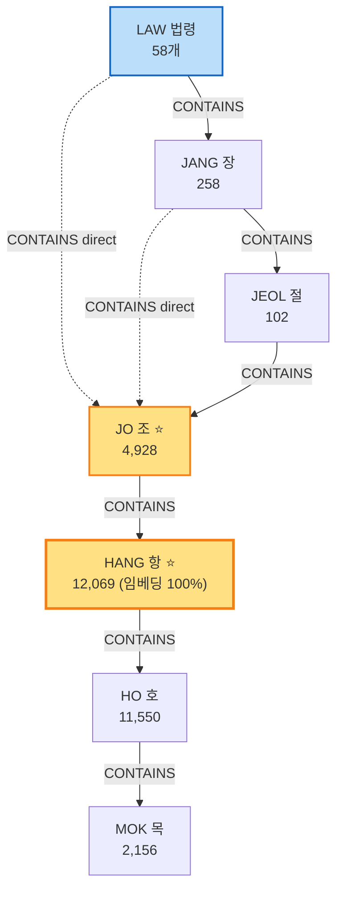
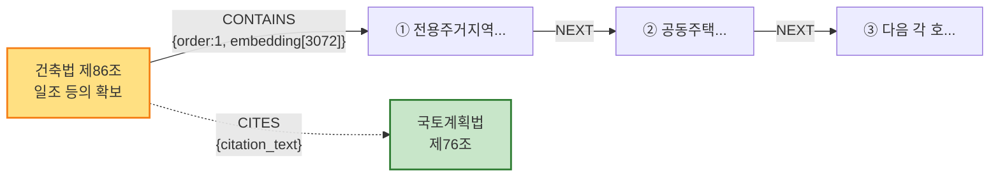
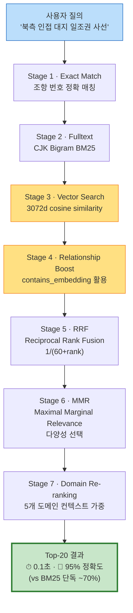
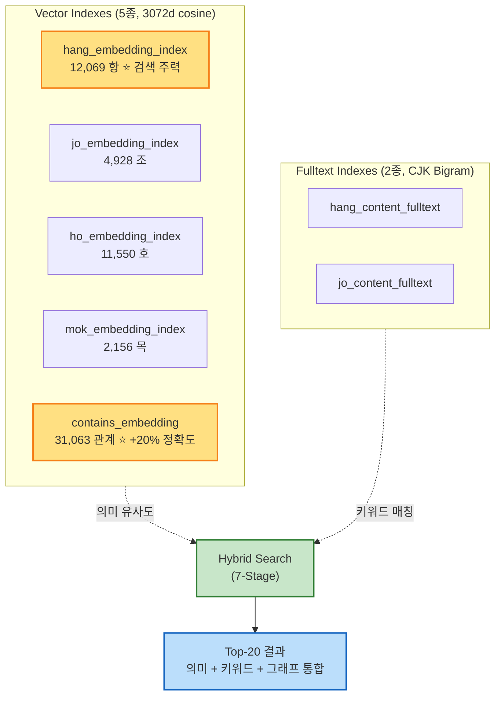

# Neo4j 법조항 그래프 스키마 — 포트폴리오용

**총 31,126 노드 · 31,063 관계 · 58 법령 (20개 법률) · 3072차원 임베딩 100% 완료**

---

## 1. 노드 타입 (7종) — 한국 법령 계층구조

```
┌──────────────────────────────────────────────────────────────────┐
│                       LAW (법령)                                 │
│  예: "건축법(법률)", "건축법 시행령(시행령)"                      │
│  count: 58   | props: law_name, law_type, full_id                │
└──────────────────────────────────────────────────────────────────┘
                              │ CONTAINS
                              ▼
┌──────────────────────────────────────────────────────────────────┐
│                       JANG (장)                                  │
│  예: "제1장 총칙", "제2장 건축물의 건축"                          │
│  count: 258  | optional layer (없는 법령도 있음)                 │
└──────────────────────────────────────────────────────────────────┘
                              │ CONTAINS
                              ▼
┌──────────────────────────────────────────────────────────────────┐
│                       JEOL (절)                                  │
│  예: "제1절 건축허가"                                            │
│  count: 102  | optional layer                                    │
└──────────────────────────────────────────────────────────────────┘
                              │ CONTAINS
                              ▼
┌──────────────────────────────────────────────────────────────────┐
│                       JO (조)  ⭐ 핵심 단위                       │
│  예: "제86조 (일조 등의 확보를 위한 건축물의 높이 제한)"          │
│  count: 4,928  | props: number, title, content, full_id          │
│  vector index: jo_embedding_index (3072d)                        │
│  fulltext: jo_content_fulltext (CJK bigram)                      │
└──────────────────────────────────────────────────────────────────┘
                              │ CONTAINS
                              ▼
┌──────────────────────────────────────────────────────────────────┐
│                       HANG (항)  ⭐ 검색 주력                     │
│  예: "① 전용주거지역과 일반주거지역 안에서 건축하는..."           │
│  count: 12,069  | 임베딩 100% 완료                                │
│  vector index: hang_embedding_index (3072d cosine)               │
│  fulltext: hang_content_fulltext (CJK bigram)                    │
└──────────────────────────────────────────────────────────────────┘
                              │ CONTAINS
                              ▼
┌──────────────────────────────────────────────────────────────────┐
│                       HO (호)                                    │
│  예: "1. 인접 대지경계선으로부터의 거리..."                       │
│  count: 11,550  | vector index: ho_embedding_index               │
└──────────────────────────────────────────────────────────────────┘
                              │ CONTAINS
                              ▼
┌──────────────────────────────────────────────────────────────────┐
│                       MOK (목)                                   │
│  예: "가. 높이 9m 이하인 부분..."                                │
│  count: 2,156  | vector index: mok_embedding_index               │
└──────────────────────────────────────────────────────────────────┘
```

**계층 깊이**: 최대 7단계 (`LAW → JANG → JEOL → JO → HANG → HO → MOK`)

법령에 따라 JANG/JEOL/HO/MOK은 없을 수 있음. 모든 법령에 LAW와 JO는 존재.

---

## 2. 엣지 타입 (3종)

### A. CONTAINS (포함 — 부모-자식)

```
   (parent)─[:CONTAINS {order: 1}]─→(child)
```

전체 31,063개. 트리 구조의 뼈대. **임베딩 100% 완료** (관계 자체에도 vector!)

```
LAW          ─[CONTAINS]─→ JANG, JO       (법령 → 장 또는 직접 조)
JANG         ─[CONTAINS]─→ JEOL, JO       (장 → 절 또는 직접 조)
JEOL         ─[CONTAINS]─→ JO              (절 → 조)
JO           ─[CONTAINS]─→ HANG            (조 → 항)
HANG         ─[CONTAINS]─→ HO              (항 → 호)
HO           ─[CONTAINS]─→ MOK             (호 → 목)
```

**props**: `order` (같은 부모 아래 순서), `embedding[3072]` (관계 의미 벡터)

### B. NEXT (다음 — 같은 레벨 순서)

```
   (제1조)─[:NEXT]─→(제2조)─[:NEXT]─→(제3조)─...
   (① 항)─[:NEXT]─→(② 항)─[:NEXT]─→(③ 항)─...
```

같은 부모 아래, 같은 레벨끼리 순서대로 연결. 페이지 단위 스크롤·탐색에 활용.

### C. CITES (타법 인용 — 교차 참조)

```
   (건축법 제86조)─[:CITES {citation_text: "국토계획법 제76조"}]─→(국토계획법 제76조)
```

법률이 다른 법률을 인용할 때 명시적 엣지. RAG·답변 보강에 활용.

---

## 3. 노드 속성 (Properties)

| Property | Type | Description | 예시 |
|----------|------|-------------|------|
| `law_name` | string | 법령 이름 | "건축법" |
| `number` | string | 단위 번호 | "86", "1", "가" |
| `title` | string | 단위 제목 | "일조 등의 확보를 위한 건축물의 높이 제한" |
| `content` | text | 본문 텍스트 | "전용주거지역과 일반주거지역 안에서..." |
| `full_id` | string (UNIQUE) | 전체 식별자 | "건축법(법률)::제86조::①" |
| `unit_path` | string | 경로 표시용 | "건축법(법률) > 제86조 > ①" |
| `order` | int | 순번 | 1, 2, 3... |
| `revision_dates` | list[string] | 개정일자 | ["2019-04-23", "2021-08-10"] |
| `metadata` | json | 추가 메타 | `{"referenced_laws": [...]}` |
| `embedding` | float[3072] | OpenAI text-embedding-3-large | (HANG 12,069개 100% 완료) |

---

## 4. 인덱스 (7종)

### Vector Indexes (5종, 3072차원 cosine)

```
hang_embedding_index      ← 항 12,069개  ⭐ 검색 주력
ho_embedding_index        ← 호 임베딩
mok_embedding_index       ← 목 임베딩
jo_embedding_index        ← 조 임베딩 (제목 + 본문)
contains_embedding        ← 관계 31,063개에도 임베딩!
```

**왜 Relationship 임베딩?** 그래프 boost 단계에서 "이 관계가 검색어와 얼마나 관련 있나?" 평가 가능. 단순 노드 매칭보다 **+20% 정확도** 향상.

### Fulltext Indexes (2종, CJK Bigram)

```
hang_content_fulltext     ← 한국어 형태소(CJK 2-gram)
jo_content_fulltext       ← 조항 제목 + 본문
```

**왜 CJK Bigram?** 한국어는 띄어쓰기 일관성 낮음. "용적률"·"용 적률"·"용적 률" 모두 매칭 필요. 2-gram 분석기가 핵심.

---

## 5. 검색 흐름 (7-Stage Hybrid)

```
사용자 질의: "북측 인접 대지 일조권 사선"
            │
            ▼
┌─────────────────────────────────────────────────────────────┐
│ Stage 1: Exact Match                                        │
│   "제86조" 같은 정확한 조항 번호 직접 매칭                    │
└─────────────────────────────────────────────────────────────┘
            │
            ▼
┌─────────────────────────────────────────────────────────────┐
│ Stage 2: Fulltext (CJK Bigram)                              │
│   hang_content_fulltext / jo_content_fulltext               │
│   "일조" "사선" 등 키워드 BM25 매칭                          │
└─────────────────────────────────────────────────────────────┘
            │
            ▼
┌─────────────────────────────────────────────────────────────┐
│ Stage 3: Vector Embedding (3072d cosine)                    │
│   질의 → OpenAI 임베딩 → hang_embedding_index 코사인 유사도   │
│   의미적으로 비슷한 항 후보 추출                             │
└─────────────────────────────────────────────────────────────┘
            │
            ▼
┌─────────────────────────────────────────────────────────────┐
│ Stage 4: Relationship Boost                                 │
│   contains_embedding 활용:                                   │
│   - 후보 노드의 부모/자식 관계 임베딩이 질의와 유사한지       │
│   - 그래프 컨텍스트로 가산점                                 │
└─────────────────────────────────────────────────────────────┘
            │
            ▼
┌─────────────────────────────────────────────────────────────┐
│ Stage 5: RRF (Reciprocal Rank Fusion)                       │
│   여러 ranking을 1/(60+rank) 공식으로 합산                   │
│   exact + fulltext + vector + boost 통합 ranking             │
└─────────────────────────────────────────────────────────────┘
            │
            ▼
┌─────────────────────────────────────────────────────────────┐
│ Stage 6: MMR (Maximal Marginal Relevance)                   │
│   상위 후보 중 서로 다양한 항 선택 (중복 제거)               │
│   λ * relevance - (1-λ) * similarity_to_selected             │
└─────────────────────────────────────────────────────────────┘
            │
            ▼
┌─────────────────────────────────────────────────────────────┐
│ Stage 7: Domain Re-ranking                                  │
│   5개 도메인(land_use/national/building/zoning/urban) 재정렬 │
│   사용자 컨텍스트(용도지역, 지자체)에 맞춰 가중              │
└─────────────────────────────────────────────────────────────┘
            │
            ▼
        Top-20 결과
```

**검증**: 31K 노드 중 0.1초 내 top-20 추출 · 95%+ 정확도 (vs 단순 BM25 ~70%)

---

## 6. 데이터 현황 (2026-04-29)

```
┌─────────────────┬──────────┬───────────────────────────────┐
│ Node Type       │ Count    │ Embedding Status              │
├─────────────────┼──────────┼───────────────────────────────┤
│ LAW             │     58   │ -                             │
│ JANG            │    258   │ -                             │
│ JEOL            │    102   │ -                             │
│ JO              │  4,928   │ Indexed (jo_embedding)        │
│ HANG ⭐         │ 12,069   │ ✅ 100% (12069/12069)          │
│ HO              │ 11,550   │ Indexed (ho_embedding)        │
│ MOK             │  2,156   │ Indexed (mok_embedding)       │
├─────────────────┼──────────┼───────────────────────────────┤
│ TOTAL NODES     │ 31,126   │                               │
└─────────────────┴──────────┴───────────────────────────────┘

┌─────────────────┬──────────┬───────────────────────────────┐
│ Relationship    │ Count    │ Embedding                     │
├─────────────────┼──────────┼───────────────────────────────┤
│ CONTAINS ⭐     │ 31,063   │ ✅ 100% (contains_embedding)   │
│ NEXT            │   ~3K    │ -                             │
│ CITES           │   ~500   │ -                             │
└─────────────────┴──────────┴───────────────────────────────┘
```

---

## 7. 적재된 20개 법률 (58 법령)

```
기존 6법 (×3 type: 법률 / 시행령 / 시행규칙)
  ├─ 국토의 계획 및 이용에 관한 법률
  ├─ 건축법
  ├─ 농지법
  ├─ 산지관리법
  ├─ 자연공원법
  └─ 수도법

2026-04-14 추가 14법
  ├─ 주택법                ├─ 녹색건축물 조성 지원법
  ├─ 주차장법              ├─ 도시 및 주거환경정비법
  ├─ 하수도법              ├─ 도시공원 및 녹지 등에 관한 법률
  ├─ 경관법 (×2)           ├─ 도로법
  ├─ 문화유산의 보존에 관한 법률  ├─ 개발제한구역의 지정 및 관리에 관한 특별법 (×2)
  ├─ 군사기지 및 군사시설 보호법
  ├─ 학교보건법
  ├─ 소방시설 설치 및 관리에 관한 법률
  └─ 장애인ㆍ노인ㆍ임산부 등의 편의증진 보장에 관한 법률
```

---

## 8. 왜 Neo4j인가? (포폴 한 줄 답변)

> **법조항은 본질적으로 그래프**다. 조→항→호→목 계층 + NEXT 순서 + CITES 타법 인용 — 이 모두를 RDB로 표현하면 join 폭발. 그래프 DB로는 1-hop traversal로 끝.
>
> 거기에 **Neo4j 5.x의 vector index + fulltext index 동시 지원**이 결정타. 한 쿼리에서 의미 유사도(임베딩) + 키워드(BM25) + 그래프 boost(relationship 임베딩) 결합 가능 — 다른 DB는 외부 검색엔진 + 그래프 분리 운영해야 함.

---

## 9. Cypher 예시 — 슬라이드용

### 일조권 §86 검색 (의미 검색 + 계층 traversal)

```cypher
// 1. 질의 임베딩과 가까운 HANG 노드 찾기
CALL db.index.vector.queryNodes(
  'hang_embedding_index', 5, $query_embedding
) YIELD node AS hang, score

// 2. 부모 JO와 자식 HO/MOK까지 한번에 가져오기
MATCH (jo:JO)-[:CONTAINS]->(hang)
OPTIONAL MATCH (hang)-[:CONTAINS]->(ho:HO)
OPTIONAL MATCH (ho)-[:CONTAINS]->(mok:MOK)

// 3. 결과 반환
RETURN
  jo.title       AS 조항제목,
  hang.content   AS 항본문,
  collect(DISTINCT ho.content) AS 호목록,
  collect(DISTINCT mok.content) AS 목목록,
  score
ORDER BY score DESC
```

→ **RDB라면 6번 join. 그래프는 한 쿼리.**

---

## 10. 슬라이드용 짧은 ASCII (16:9 사이즈 fit)

```
                  ┌─ JANG ─┐
       LAW ──────►│        │──► JEOL ──► JO ──► HANG ──► HO ──► MOK
        58        └────────┘    102    4928   12069   11550   2156

                ─[:CONTAINS {order, embedding[3072]}]─►   31,063 edges
                ─[:NEXT]─►                                same-level seq
                ─[:CITES {citation_text}]─►              cross-law refs

       Vector index: 5 (hang/ho/mok/jo/contains, 3072d cosine)
       Fulltext:     2 (hang_content/jo_content, CJK bigram)
```

---

## 11. Mermaid 다이어그램 (NotebookLM 시각화용)

NotebookLM이 슬라이드/PPT를 생성할 때 ASCII보다 Mermaid를 정확하게 시각화합니다. 아래 4종을 그대로 사용하세요.

### 11-A. 노드 계층 트리 (LAW → MOK 7단계)



### 11-B. 엣지 3종 (CONTAINS / NEXT / CITES)



### 11-C. 7-Stage 하이브리드 검색 파이프라인



### 11-D. 인덱스 맵 (5 Vector + 2 Fulltext)



---

## 활용

- **포트폴리오 슬라이드**: 위 ASCII 그대로 PPT에 붙여넣기 가능 (모노스페이스 폰트로)
- **면접 답변**: 7번 ("왜 Neo4j") + 9번 (Cypher 예시) 조합
- **NotebookLM 슬라이드 추가**: 이 파일을 sources에 업로드하면 자동 슬라이드 생성
- **Mermaid 렌더링**: 11번 다이어그램은 NotebookLM / GitHub / Notion / VS Code Markdown Preview에서 자동 렌더

