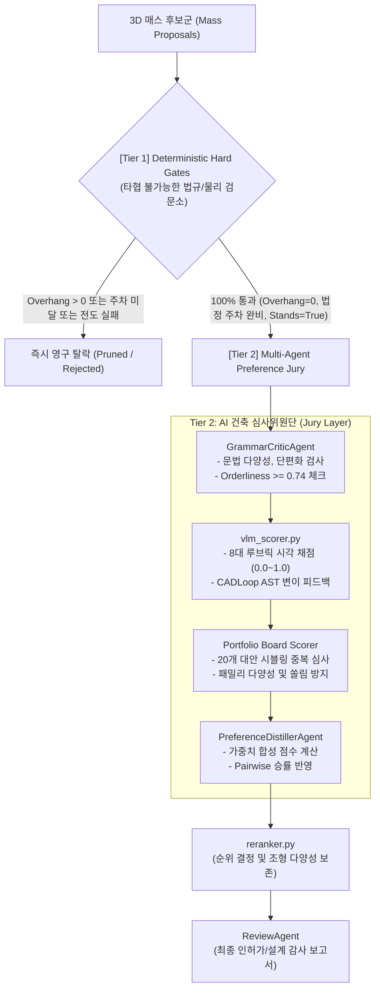

# Two-Tier Neuro-Symbolic Architectural Scoring & Evaluation Architecture

본 문서는 **MassAgent / 25_ACE / ARR** 시스템에서 작동하는 2단계 하이브리드(Two-Tier Neuro-Symbolic) 건축 매스 평가 및 순위 결정 파이프라인의 명세서입니다.

---

## 1. 아키텍처 개요 (Two-Tier Evaluation Paradigm)

건축 AI 분야의 최대 난제는 "LLM/VLM에게 법규나 물리 계산을 맡기면 환각(Hallucination)으로 인해 위법 건축물이 양산된다"는 점입니다.  
본 시스템은 이를 극복하기 위해 **하드 게이트(결정론적 물리/법규 검증기)**와 **소프트 스코어(VLM 다차원 건축 선호도 심사위원)**를 엄격히 분리(Decoupling)합니다.



---

## 2. [Tier 1] Deterministic Hard Gates (절대 무관용 검문소)

VLM 점수가 만점이라도 다음 하드 게이트 중 하나라도 실패하면 즉시 탈락 처리되며, VLM은 법규나 주차를 번복할 수 없습니다:

1. **대지 경계 침범률 0.0000 ㎡ (`overhang == 0.0000 m²`)**:
   - 도로 소요너비 미달 후퇴선(건축법 제46조) 및 일조사선(시행령 제86조)을 단 1mm도 침범하지 않아야 함.
   - 모서리 절단(Chamfer) 방지를 위해 경계선 내부 최소 1.4m 안전 버퍼 확보.
2. **구조 자립성 (`stands == True`)**:
   - `cantilever_ratio <= 1.6` 충족.
   - 자중 지지율 및 전도 모멘트 안전율 확보.
3. **법정 건폐율 및 용적률 준수**:
   - 지자체 조례 상한 최우선 적용.
   - 지하층 및 지상 주차장 면적은 용적률 산정용 연면적에서 엄격히 제외(시행령 제119조).
4. **법정 주차 유효 대수 (`parkingPass >= legalRequired`)**:
   - MasterPlanAgent가 생성한 P01~P08 표준 자주식(2.5m×5.0m) 유효 배치 완료.
5. **용적 목표치 달성률 (`capacity_utilization >= 0.70`)**:
   - 대지의 잠재 가치를 실현하는 최소 요구 볼륨 충족.

---

## 3. [Tier 2] Multi-Agent Preference & VLM Scoring

### 1) 8대 세부 평가 루브릭 (`architecture_massing_weights.v1.json`)

| 평가 개념 (Concept) | 가중치 ($w$) | 질의 문항 (`architecture_massing_qa.v1.json`) | 심사 목적 |
|---|:---:|---|---|
| **`gesture_clarity`** | **0.22** | Does the massing have one clear dominant geometric gesture? | 전체 형태를 지배하는 단 하나의 명확한 형태 언어가 존재하는가? |
| **`hierarchy`** | **0.18** | Is the main/support mass hierarchy readable without random fragments? | 주동과 부속동의 크기·위치 위계가 무작위 조각 없이 정돈되었는가? |
| **`non_stair_silhouette`** | **0.18** | Does the silhouette avoid relying mainly on stair-step or simple stepback form? | 법규 사선제한만 쫓아 기계적으로 깎아낸 계단식(Cake-tier) 매스를 탈피했는가? |
| **`void_publicness`** | **0.12** | Does the massing use void, courtyard, undercut, or open ground logic in an architecturally meaningful way? | 공공 보행자에게 개방된 중정, 언더컷, 필로티, 진입 틈새가 유의미한가? |
| **`repair_integrity`** | **0.14** | Does the final mass preserve its source geometry after legal repair? | 법규 슬라이스 적용 후에도 건축가의 원형 조형 비례가 보존되었는가? |
| **`precedent_resonance`** | **0.16** | Does the candidate resonate with a recognizable architectural massing principle without copying a precedent? | 단순 표절이 아닌 OMA/BIG/SANAA 등 검증된 현대 건축 유형학적 원리를 지녔는가? |
| **`program_appropriateness`** | 부가 | Visible mass and hierarchy plausibly support program_context. | 건물 용도(미술관, 체육관, 근린생활 등)에 부합하는 공간 스팬과 규모인가? |
| **`section_program_fit`** | 부가 | Section/roof/void relationships support program rather than arbitrary sculpture. | 지붕 및 단면 관계가 프로그램을 지원하는가 (예: 장스팬 대공간, 박공 단면)? |

### 2) 포트폴리오 보드 시블링 중복 평가 (`score_portfolio_board_with_openai_vlm`)
- 개별 매스를 개별적으로 평가하면 20개 대안이 모두 그럴듯한 '단순 박스'나 '계단형 타워'로 통일되는 **'시블링 붕괴(Sibling Repetition)'**가 발생합니다.
- 포트폴리오 보드 심사기는 20개 대안의 4뷰 시트를 한눈에 펼쳐놓고:
  - 패밀리 다양성 수(`visible_family_count >= 6`)
  - 지배적 패밀리 점유율(`dominant_family_share <= 0.35`)
  - 실패 사유(`box_dominated`, `pyramid_dominated`, `repeated_roof` 등)를 검출하여 탈락 및 교체 명령을 내립니다.

### 3) CADLoop 스타일의 Neuro-Symbolic AST 기하학 수정 피드백
VLM 비평기는 텍스트 지적에 그치지 않고, 다음 세대 생성을 위한 **실행 가능한 AST 변이 연산자**를 직접 발행합니다:
- `replace_operator`: 예) `box_stack` → `bent_bar` 또는 `courtyard`
- `set_parameter`: 예) `margin_ratio`, `open_side`, `terrace_depth`
- `set_control_point`: 예) `sloped_roof_mass`, `taper`, `bend`의 3D 제어점 이동
- `add_node`: 지배 주동에 공공성을 부여하는 `carve_void`, `piloti`, `notch` 노드 삽입

---

## 4. 단위 및 통합 테스트 검증 (`design/test_maas_preference.py`)

54개 전수 테스트가 100% 정상 통과함을 실측 완료하였습니다:

```text
======================= 54 passed, 87 warnings in 9.36s =======================
```

- **하드게이트 보존 검증**: `test_build_preference_distillation_preserves_hard_gates` (PASSED)
- **조각난 파편 매스 기각**: `test_clean_mass_gate_rejects_surface_and_volume_fragmentation` (PASSED)
- **VLM 비평의 기하학 변이 연동**: `test_box_bias_vlm_action_becomes_continuous_geometry_mutation` (PASSED)
- **Closed-loop 자율 개선 사이클**: `test_same_run_critic_loop_mutates_rescores_and_accepts_improvement` (PASSED)
- **인간 심사위원 선호도 반영**: `test_pairwise_wins_adjust_reranking` (PASSED)
